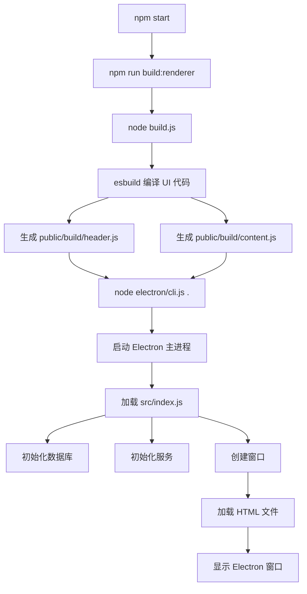

# npm start 启动流程详解

## 🎯 核心答案

**`npm start` 启动的是一个 Electron 桌面应用**，不是静态服务器！

---

## 📊 启动流程图



---

## 🔍 详细步骤解析

### **步骤 1: 构建渲染进程代码**
```bash
npm run build:renderer
```

**作用**: 使用 esbuild 编译 UI 代码

**输入文件**:
- `src/ui/app/HeaderController.js` → 主窗口控制器
- `src/ui/app/PickleGlassApp.js` → 内容窗口组件

**输出文件**:
- `public/build/header.js` (编译后的头部代码)
- `public/build/content.js` (编译后的内容代码)

**为什么需要编译？**
- 将 JSX 转换为普通 JavaScript
- 打包所有依赖到单个文件
- 生成 source maps 用于调试

---

### **步骤 2: 启动 Electron**
```bash
node ./node_modules/electron/cli.js .
```

**作用**: 启动 Electron 应用

**等价于**: `electron .` (运行当前目录的 Electron 应用)

**Electron 会做什么？**
1. 读取 `package.json` 的 `main` 字段
2. 找到入口文件: `src/index.js`
3. 在 Node.js 环境中执行 `index.js`

---

### **步骤 3: 主进程初始化** (`src/index.js`)

```javascript
// 1. 初始化数据库
await databaseInitializer.initialize();

// 2. 初始化认证服务
await authService.initialize();

// 3. 初始化模型状态服务
await modelStateService.initialize();

// 4. 创建 Electron 窗口
createMainOnlyWindow();
```

**关键点**:
- ✅ **不启动任何 Web 服务器**
- ✅ 所有通信通过 IPC (进程间通信)
- ✅ 窗口直接加载本地 HTML 文件

---

### **步骤 4: 创建窗口** (`src/window/windowManager.js`)

```javascript
// 创建主窗口
const header = new BrowserWindow({
    width: 353,
    height: 47,
    frame: false,
    transparent: true,
    // ...
});

// 加载本地 HTML 文件
header.loadFile(path.join(__dirname, '../ui/app/header.html'));
```

**窗口类型**:
- `header` - 主控制窗口
- `listen` - 语音识别窗口
- `ask` - AI 对话窗口
- `settings` - 设置窗口

---

## 🏗️ 应用架构

```
┌─────────────────────────────────────────────────┐
│  Electron 应用 (桌面应用)                        │
├─────────────────────────────────────────────────┤
│                                                  │
│  ┌──────────────┐        ┌──────────────┐      │
│  │  主进程       │  IPC   │  渲染进程     │      │
│  │  (Node.js)   │◄──────►│  (Chromium)  │      │
│  └──────────────┘        └──────────────┘      │
│       │                         │               │
│       │                         │               │
│  ┌────▼─────┐             ┌────▼─────┐         │
│  │ 数据库    │             │ UI 组件   │         │
│  │ 服务      │             │ (HTML/JS) │         │
│  │ AI 模型   │             │           │         │
│  └──────────┘             └──────────┘         │
│                                                  │
└─────────────────────────────────────────────────┘
```

---

## 🆚 对比：Electron vs Web 服务器

### **Electron 应用 (现在)**
```
启动: npm start
进程: Electron (桌面应用)
UI: 本地 HTML 文件
通信: IPC (进程间通信)
端口: 无需端口
访问: 桌面窗口
```

### **Web 服务器 (之前有，现已移除)**
```
启动: npm run dev
进程: Node.js + Express
UI: HTTP 服务器
通信: HTTP API
端口: 3000, 8080
访问: 浏览器 (localhost:3000)
```

---

## 📁 文件加载方式

### **主窗口 (header)**
```javascript
header.loadFile('src/ui/app/header.html')
```
↓ 加载
```html
<script src="../../../public/build/header.js"></script>
```
↓ 包含
```javascript
// HeaderController.js (已编译)
// WelcomeHeader.js
// ApiKeyHeader.js
// MainHeader.js
```

### **内容窗口 (listen/ask/settings)**
```javascript
listen.loadFile('src/ui/app/content.html', { query: { view: 'listen' } })
```
↓ 加载
```html
<script src="../../../public/build/content.js"></script>
```
↓ 包含
```javascript
// PickleGlassApp.js (已编译)
// ListenView.js
// AskView.js
// SettingsView.js
```

---

## 🎯 总结

| 特性 | 说明 |
|------|------|
| **应用类型** | Electron 桌面应用 |
| **运行环境** | Node.js + Chromium |
| **UI 技术** | HTML + JavaScript (Web Components) |
| **通信方式** | IPC (进程间通信) |
| **网络需求** | 无需网络 (除了 AI API 调用) |
| **端口占用** | 无 |
| **访问方式** | 桌面窗口 (不是浏览器) |

**关键点**: 这是一个**完全独立的桌面应用**，不依赖任何 Web 服务器！
